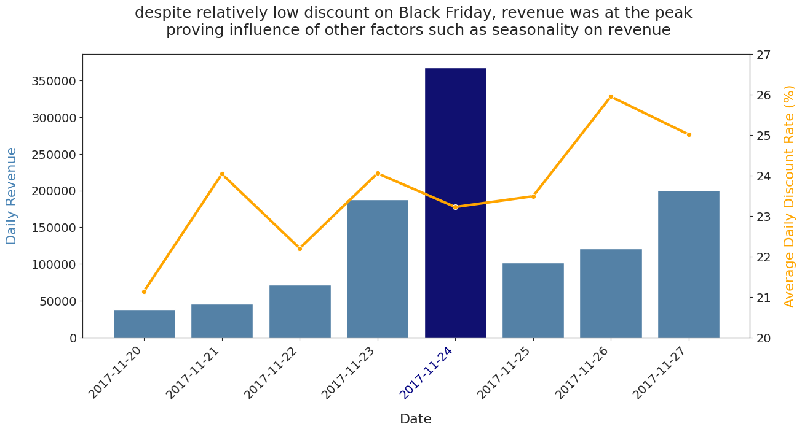

# Tech Company (ENIAC) Discount Analysis

## Project Overview

ENIAC, which sells tech products, is facing a question on how to approach discounting of its products. Board members are torn between reducing discounts and focusing on product quality, while the marketing lead believes discounts help retain and enhance customer acquisition.

This project explores different datasets to answer the business question of whether and how, if at all, revenue is impacted by discounts (correlation) and whether other factors may help inform management's strategy moving forward.

Using Python and other libraries, the analysis indicates that **discounts do not appear to be a strong driver of revenue**.

---

## Dataset & Sources

ENIAC provided datasets on:

### Orders
**Datatypes** ✓
- `'created_date'` should be datetime ✓

**Bad columns** ✓
- `'order_id'` could rather be `'id_order'` or vice versa for easier alignment.

**Miscellaneous**
- Lots of orders were in unusual intermediate states. Are only the newest orders like that?
- At least one order had a `'total_paid'` of `0`.
- Another had a `'total_paid'` of over 200,000, which required investigation.

**Missing values** ✓

| Column | # Missing | Severity |
|---|---:|---|
| `'total_paid'` | 5 | Mid |

---

### Orderlines
**Datatypes** ✓
- `'unit_price'` should be numeric ✓
- `'date'` should be datetime ✓

**Bad columns** ✓
- `'id'` is simply a different index.
- `'product_id'` contains only `0`s.

**Duplicates**
- Duplicates should be checked after the unique `'id'` column is excluded.

**Miscellaneous**
- Some product quantities appear abnormal and potentially untrustworthy.

---

### Products
**Datatypes**
- `'price'` and `'promo_price'` were not initially convertible to numbers.

**Bad columns**
- `'in_stock'` is useful for fulfillment but not required for the main analysis.
- `'type'` is somewhat unclear, but was retained for potential analysis.

**Missing values**

| Column | # Missing | Severity |
|---|---:|---|
| `'desc'` | 7 | Low |
| `'price'` | 46 | Very High |
| `'type'` | 50 | Low |

**Duplicates**
- More than 8,700 rows (~45% of the dataset) were identified as duplicates.

---

### Brands
The brands dataset required no cleaning.

---

## 🚀 Key Findings & Results

### 1. Discounts do not appear to drive revenue

The analysis did not identify a strong relationship between discount levels and revenue. A mathematical correlation of -0-03 was found.

This suggests that increasing discounts alone is unlikely to be a reliable strategy for increasing revenue.

### 2. Seasonality using Black Friday week 

Despite relatively low discounts on Black Friday, **revenue and order counts reached their peak**.

This suggests that factors such as seasonality and increased purchasing activity also had a strong influence on revenue.

### 3. Discounting should not be viewed in isolation

Revenue is influenced by multiple factors. ENIAC should therefore consider:

- Seasonality
- Product demand
- Order volume
- Product brand (Apple appeared to sell more regardless of discount)
- Customer purchasing behavior
- Promotional periods

rather than assuming that larger discounts automatically result in higher revenue.

---

## 📈 Visualizations

### Black Friday Performance

---

## 💡 Business Implications

Based on the analysis, ENIAC could consider:

- **Reducing reliance on discounts** as a primary revenue-growth strategy.
- **Investigating seasonality and purchasing occasions** that naturally increase demand.
- **Focusing on product value and assortment** alongside promotional activity.
- Using **targeted promotions** where they can be shown to influence customer behavior.
- Separately evaluating the effect of discounts on **customer acquisition and retention**, since revenue impact and customer-retention impact are not necessarily the same.
- Better data infrastructure is srequired
---

## 🛠️ Technologies Used

### Programming

- Python
  - [pandas](https://pandas.pydata.org/)
  - [matplotlib](https://matplotlib.org/)
  - [seaborn](https://seaborn.pydata.org/)

### Environment

- [Google Colab](https://colab.research.google.com/)

---

## 🔄 Project Workflow

**Data Exploration → Data Cleaning → Quality Control → Data Analysis → Final Presentation**

---

## 📧 Contact
berthamweza@gmail.com
[LinkedIn](https://www.linkedin.com/in/bertha-lwakatare/)
